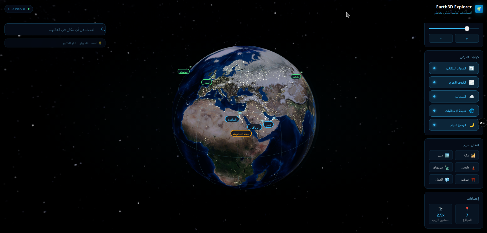

# 🌍 Earth3D Explorer



تطبيق Next.js لاستكشاف الكرة الأرضية ثلاثية الأبعاد بشكل تفاعلي.

---

## 🚀 إعداد المشروع

### 1. تثبيت المكتبات
```bash
npm install
```

### 2. إعداد Google Cloud

#### أ. إنشاء مشروع
1. اذهب إلى [Google Cloud Console](https://console.cloud.google.com/)
2. أنشئ مشروعاً جديداً أو اختر موجوداً

#### ب. تفعيل الـ APIs المطلوبة
في قائمة **APIs & Services** → **Enable APIs**، فعّل:
- ✅ **Maps JavaScript API** — للخرائط وعرض المواقع
- ✅ **Places API** — للبحث عن الأماكن
- ✅ **Geocoding API** — لتحويل الأسماء إلى إحداثيات
- ✅ **Maps Embed API** — (اختياري) لتضمين الخرائط

#### ج. إنشاء API Keys
في **APIs & Services** → **Credentials** → **Create Credentials** → **API Key**:

**مفتاح للـ Frontend** (يظهر في المتصفح):
- اسمه: `Earth3D Browser Key`
- القيود: اختر **HTTP referrers** → أضف `localhost:3000/*` و `yourdomain.com/*`
- APIs المسموح بها: Maps JS API, Places API

**مفتاح للـ Backend** (سيرفر آمن):
- اسمه: `Earth3D Server Key`
- القيود: **IP addresses** إذا أردت
- APIs المسموح بها: Geocoding API

### 3. إعداد ملف `.env.local`
```env
NEXT_PUBLIC_GOOGLE_MAPS_API_KEY=AIzaSy...مفتاحك_هنا
GOOGLE_MAPS_SERVER_API_KEY=AIzaSy...مفتاح_السيرفر
GOOGLE_CLOUD_PROJECT_ID=your-project-id
```

### 4. إضافة Textures (اختياري للجودة العالية)
ضع ملفات الـ Textures في مجلد `/public/textures/`:
```
public/
└── textures/
    ├── earth_day.jpg       ← خريطة النهار (2048×1024 أو أعلى)
    ├── earth_night.jpg     ← خريطة الليل
    ├── earth_specular.jpg  ← خريطة الانعكاس
    ├── earth_normal.jpg    ← خريطة التضاريس
    └── clouds.jpg          ← طبقة السحاب
```
يمكن تحميلها مجاناً من: [NASA Visible Earth](https://visibleearth.nasa.gov/)

### 5. تشغيل التطبيق
```bash
npm run dev
```
افتح [http://localhost:3000](http://localhost:3000)

---

## 📦 المكتبات المستخدمة

| المكتبة | الغرض |
|---------|--------|
| `three` | محرك الرسومات ثلاثية الأبعاد |
| `@react-three/fiber` | دمج Three.js مع React |
| `@react-three/drei` | مساعدات جاهزة لـ R3F |
| `gsap` | أنيميشن سلس واحترافي |
| `framer-motion` | أنيميشن واجهة المستخدم |
| `@googlemaps/js-api-loader` | تحميل Google Maps API |
| `zustand` | إدارة الحالة |
| `tailwindcss` | CSS utility-first |
| `leva` | لوحة تحكم للمطورين |

---

## 🎮 كيفية الاستخدام

| الإجراء | الوصف |
|---------|--------|
| 🖱️ سحب | تدوير الكرة الأرضية |
| 🖱️ تمرير | تكبير/تصغير |
| 🔍 البحث | ابحث عن أي مكان في العالم |
| 📍 نقر على موقع | عرض التفاصيل |
| ⚙️ لوحة التحكم | تغيير خيارات العرض |

---

## 🏗️ هيكل المشروع

```
earth3d/
├── app/
│   ├── layout.tsx       ← الـ Layout الرئيسي
│   ├── page.tsx         ← الصفحة الرئيسية
│   └── globals.css      ← الأنماط العامة
├── components/
│   ├── Earth3D.tsx      ← مكوّن الكرة الأرضية (Three.js)
│   ├── SearchPanel.tsx  ← لوحة البحث
│   ├── ControlPanel.tsx ← لوحة التحكم
│   └── MarkerInfo.tsx   ← نافذة معلومات الموقع
├── lib/
│   ├── store.ts         ← إدارة الحالة (Zustand)
│   └── maps.ts          ← وظائف Google Maps
├── types/
│   └── index.ts         ← TypeScript Types
├── public/
│   └── textures/        ← ملفات الـ Textures
├── .env.local           ← متغيرات البيئة (لا ترفعه!)
├── package.json
├── tailwind.config.ts
├── tsconfig.json
└── next.config.ts
```