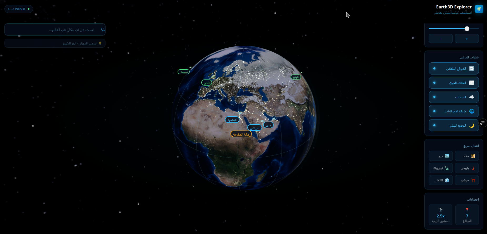

<div dir="rtl" align="center">

# 🌍 Earth3D Explorer

تجربة ويب تفاعلية لاستكشاف الأرض والنظام الشمسي ثلاثي الأبعاد، مع بحث جغرافي وخرائط طرق ومعلومات تفصيلية عن الأماكن.



<p>
  
  
  
  
  
  
  
</p>

[English](README.md) · **العربية**

</div>

## نبذة

يجمع **Earth3D Explorer** بين عرض كروي واقعي للأرض وطبقات السحب وأضواء المدن، وبين خدمات Google Maps للبحث عن الأماكن واستعراض الخرائط. ويمكن للمستخدم الانتقال من المشهد الفضائي إلى خريطة الطرق، تحديد موقعه الحالي، إدخال إحداثيات مباشرة، واستكشاف كواكب النظام الشمسي من الواجهة نفسها.

## المزايا

- كرة أرضية ثلاثية الأبعاد عالية الدقة تعمل بـ WebGL، مع دوران وتكبير وتحريك سلس للكاميرا.
- عرض طبقات الأرض النهارية، أضواء المدن الليلية، السحب المتحركة، الغلاف الجوي، وخلفية درب التبانة.
- محاكاة النهار والليل على الكرة الأرضية، مع حساب اتجاه الشمس اعتمادًا على الوقت العالمي UTC والتاريخ الحالي والميل الشمسي الموسمي.
- بحث عن المدن والمعالم والأماكن عبر Google Places، مع العنوان والتقييم والصور والهاتف والموقع وساعات العمل عند توفرها.
- البحث بالإحداثيات، والتحويل بين العنوان والإحداثيات، وإظهار العلامات على سطح الكرة.
- تحديد الموقع الحالي عبر Geolocation وعرضه كنقطة زرقاء نابضة.
- انتقال تلقائي إلى خريطة Google عند الاقتراب من سطح الأرض، مع وضعي خريطة الطرق والقمر الصناعي.
- اختيار وجهة وفتح الملاحة إليها في Google Maps بالسيارة أو سيرًا على الأقدام.
- استكشاف الشمس والقمر والكواكب الثمانية، مع حركة مدارية ومعلومات وحقائق مختصرة لكل جرم.
- خيارات للتحكم في الدوران، سرعة الحركة، التكبير، السحب، الغلاف الجوي، شبكة الإحداثيات، والوضع الليلي.
- واجهة متجاوبة مع شاشات سطح المكتب والأجهزة اللوحية والهواتف.

## النهار والليل واتجاه الشمس

يحسب التطبيق موضع الشمس من وقت UTC الحالي ومن اليوم ضمن السنة، ثم يستخدم الميل الشمسي الموسمي لتحديد اتجاه الإضاءة بالنسبة إلى الأرض. لذلك يتجه ضوء الشمس نحو الجانب النهاري الصحيح، بينما تظهر أضواء المدن على الجانب الليلي. هذا الحساب مناسب للمحاكاة البصرية التفاعلية، وهو تقريب فلكي وليس أداة أرصاد أو ملاحة علمية عالية الدقة.

## التقنيات المستخدمة

| التقنية | الاستخدام |
|---|---|
| Next.js 14 + React 18 | بنية التطبيق والصفحات ومكونات الواجهة |
| TypeScript | الأنواع والتحقق الساكن |
| Three.js | الرسم ثلاثي الأبعاد وWebGL والخامات والإضاءة |
| React Three Fiber | بناء مشاهد Three.js باستخدام React |
| React Three Drei | أدوات الكاميرا والتحكم والنصوص والمساعدات ثلاثية الأبعاد |
| GSAP + Framer Motion | انتقالات الكاميرا وحركات الواجهة |
| Google Maps JavaScript API | خريطة الطرق والقمر الصناعي |
| Places + Geocoding | البحث عن الأماكن والتفاصيل وتحويل الإحداثيات |
| Zustand | إدارة حالة البحث والعلامات وإعدادات العرض |
| Tailwind CSS | تصميم الواجهة المتجاوبة |

## متطلبات التشغيل

- Node.js حديث متوافق مع Next.js 14.
- [pnpm](https://pnpm.io/).
- متصفح يدعم WebGL وتسريع الرسومات.
- مفتاح Google Maps Platform لتفعيل البحث والخرائط الحية. تبقى الكرة الأرضية وبعض نتائج البحث التجريبية متاحة عند غياب المفتاح.

## البدء السريع

1. ثبّت الاعتماديات:

   ```bash
   pnpm install
   ```

2. أنشئ ملف `.env.local` في جذر المشروع:

   ```env
   NEXT_PUBLIC_GOOGLE_MAPS_API_KEY=your_browser_api_key
   ```

3. شغّل خادم التطوير:

   ```bash
   pnpm dev
   ```

4. افتح [http://localhost:3000](http://localhost:3000).

## إعداد Google Maps Platform

من [Google Cloud Console](https://console.cloud.google.com/):

1. أنشئ مشروعًا أو اختر مشروعًا موجودًا.
2. فعّل **Maps JavaScript API** و**Places API (New)** و**Geocoding API**.
3. أنشئ مفتاح API مخصصًا للمتصفح.
4. قيّد المفتاح باستخدام **HTTP referrers**، مثل:

   ```text
   http://localhost:3000/*
   https://your-domain.example/*
   ```

5. قيّد المفتاح على واجهات API المطلوبة فقط، ثم ضعه في `NEXT_PUBLIC_GOOGLE_MAPS_API_KEY`.

> متغيرات `NEXT_PUBLIC_*` تصل إلى المتصفح؛ لذلك لا تستخدم فيها أسرارًا، ولا تترك مفتاح Google بلا قيود.

## الاستخدام

| الإجراء | النتيجة |
|---|---|
| السحب | تدوير المشهد حول الأرض أو الكوكب |
| عجلة الفأرة أو إيماءة القرص | التكبير والتصغير |
| البحث | العثور على مكان وتحريك الكاميرا إليه |
| تبويب «إحداثيات» | إضافة علامة باستخدام خط العرض وخط الطول |
| تبويب «موقعي» | طلب موقع الجهاز والانتقال إليه |
| الاقتراب من الأرض | فتح خريطة الطرق تلقائيًا |
| النقر على الخريطة | عرض بيانات المكان أو الإحداثيات |
| «الاتجاهات» | فتح مسار الوجهة في Google Maps |
| قائمة الكواكب | الانتقال إلى جرم وعرض معلوماته |

## المسارات

| المسار | الوصف |
|---|---|
| `/` | تجربة الأرض الرئيسية |
| `/earth` | تجربة الأرض نفسها بمسار صريح |
| `/solar` | عارض مستقل للنظام الشمسي |

## بنية المشروع

```text
world_map_3D/
├── public/
│   ├── earth3d.png
│   └── textures/              # خامات الأرض والفضاء والكواكب
├── src/app/
│   ├── components/
│   │   ├── Earth3D.tsx        # مشهد الأرض والكواكب وخريطة Google
│   │   ├── SolarSystem.tsx    # عارض النظام الشمسي المستقل
│   │   ├── SearchPanel.tsx    # البحث والإحداثيات والموقع الحالي
│   │   ├── ControlPanel.tsx   # إعدادات العرض والكاميرا
│   │   ├── PlaceInfoPanel.tsx # معلومات الأماكن
│   │   └── RoutePanel.tsx     # اختيار نمط الرحلة وفتح الملاحة
│   ├── earth/page.tsx
│   ├── solar/page.tsx
│   ├── lib/
│   │   ├── maps.ts            # تكامل Google Maps والتحويلات الجغرافية
│   │   └── store.ts           # مخزن Zustand
│   ├── types/index.ts
│   ├── layout.tsx
│   └── page.tsx
├── next.config.mjs
├── package.json
└── pnpm-lock.yaml
```

## أوامر المشروع

```bash
pnpm dev         # تشغيل بيئة التطوير
pnpm build       # إنشاء نسخة الإنتاج
pnpm start       # تشغيل نسخة الإنتاج
pnpm type-check  # فحص TypeScript
pnpm lint        # تشغيل فحص Next.js
```

## ملاحظات

- خامات الأرض والكواكب موجودة داخل `public/textures` وتُحمّل محليًا.
- جودة التجربة تعتمد على دعم WebGL وقدرة الجهاز الرسومية.
- الوصول إلى الموقع الحالي يتطلب إذن المستخدم وسياقًا آمنًا HTTPS في بيئة الإنتاج.
- تفاصيل الأماكن والصور وساعات العمل تعتمد على البيانات المتاحة من Google وعلى صلاحيات مفتاح API.
